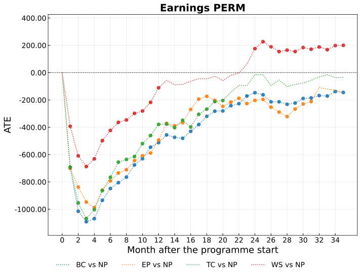

## Introduction {.center}
::: {.incremental}
What happens if a person becomes unemployed in Switzerland?
{width=80% style="display: block; margin: auto;"}
:::

## Introduction {.center}
::: {.incremental}
**Active Labor Market Policies (ALMP):** Government interventions designed to enhance employment outcomes of unemployed

- **Basic course (BC)**: Orientation and job search skills
- **Training course (TC)**: Language, IT, or vocational training for particular sectors
- **Employment Programme (EP)**: Unpaid work outside the regular labor market
:::

<!---->

## This paper  {.center}
::: {.incremental}

- Evaluate heterogeneities in the effectiveness of Swiss ALMPs and provide recomendation on the allocation to programmes using causal machine learning and a rich administrative data

:::
. . .

::: {.incremental}
**Contributions:**

- **New data:** Evaluation for a more recent time period

- **New methods:**

    - Uncover heterogeneity (and its drivers) beyond the average effect, programme that is ineffective on average might still be beneficial for particular subgroups
    - Provide interpretable data-driven recommendations for improved allocations to programmes
:::

<!--
## Literature {.center}
::: {.incremental}
**Meta studies**: (e.g. Card, Kluve and Weber, 2018) 
  
- Large variation across countries, types of programmes, and groups of unemployed  
:::

. . .

::: {.incremental}
**Switzerland**: (Gerfin and Lechenr, 2002; Lalive, Van Ours, and Zweimüller, 2008) 

- Positive effects for wage subsidies  
- Negative effects for employment programmes  
- Mixed results for training courses  
:::


. . .

::: {.incremental}
**Causal ML and ALMPs**: (Cockx, Lechner and Bollens, 2023; Knaus, Lechner, Strittmatter, 2022)

- Heterogeneities with respect to gender, nationality, previous labour market success, and qualifications  
:::
-->


<!---->


## Data {.center}
::: {.incremental}

Dataset from diverse Swiss administrative records (2004-2018)
with individuals entering unemployment between 01/2014 and 06/2015
:::
. . .

::: {.incremental}
**Two samples** analysis depending on migration background:

- **Permanent Residence (PERM):** Swiss and long term migrants
- **Temporary Residence (TEMP):** More recent migrants
:::

<!---->

## Data {.center}
::: {.incremental}

**Outcomes:**

- Employment status and earnings during 36 months after programme start
(monthly and several aggregates)
<!--
- For control group pseudo start dates are predicted based on sample of
program participants
-->
:::
. . .

::: {.incremental}
**Covariates:**

- Employment and earnings history over 10 years
- Socio-demographic characteristics
- Information on prior jobs and unemployment spells
- Regional labor market characteristics

:::

<!--
 **ATE**: average treatment effect for a population of interest
- **BGATE**: average treatment effect for a larger group of interest balanced for a subgorup of the covariates
- **IATE**: average treatment effect for a unit with specific values of covariates
- **Optimal Policy Rule**: a mapping from covariates to treatment which maximise the average outcome under the specific treatment
-->

<!---->

## Parameters of interest {.center}

<span style="color:#0a5f2d;">**Treatment Evaluation**<span>

- **ATE** $\,\,\,\, \implies \tau_{d} :=  \mathbb{E}[ Y^d - Y^{0}]$
   - average treatment effect for the whole population
- **BGATE** $\implies \tau_{d}^B(z) :=  \mathbb{E}\left[\mathbb{E}[ \,  Y^d - Y^{0} \, | \,  Z = z, W]\right]$ 
    - average treatment effect for a subgroup balanced for some covariates to ensure comparability
- **IATE** $\,\,\implies \tau_{d} ( x ) := \mathbb{E}[ \,  Y^d - Y^{0} | X = x ]$
   - average treatment effect for a unit with specific values of covariates


<div style="font-size: 0.7em;">
Notation

- $Y^d, d \in  \{0,\dots ,4\}$: Potential outcomes      
- $Z$: Covariates for which we want to assess heterogeneity
- $W$: Covariates used to balance
- $X$: All covariates (includes $Z$ and $W$)


<!---->

## Parameters of interest {.center}

<span style="color:#0a5f2d;">**Treatment Recommendation**<span>

- **Optimal Assignment rule** $\pi^*=\arg\max_{\pi \in \Pi} Q(\pi)$
   - mapping from covariates to treatment which maximise the average outcome under the specific treatment


<div style="font-size: 0.7em;">
Notation

- $V$: Policy variables, subset of the $X$ covariates    
- $\pi(V)$: Policy rule for conditional treatment choice 
- $Y^{\pi(V)}]$: Potential outcome under policy
- $Q(\pi) = \mathbb{E} [Y^{\pi(V)}]$: Value function, average potential outcome under the policy


## Identification {.center}

::: {.incremental}

- **Conditional independence assumption**
    - Control for most of the **information caseworkers observe** at the point of the assignment
    - Condition on **key confounders** identified in the literature
    - **Placebo analysis**: no evidence for violations

- **Common support assumption**: exclude observations outside support
- **Stable unit treatment value assumption**:  no-spillover effects
- **Exogeneity of covariates**: only pre-treatment covariates
:::

<!---->

## Estimators {.center}
::: {.incremental}

**Modified Causal Forests (MCF)** (Lechner 2018, Lechner and Mareckova, 2024)

- Extension of CF (Wager and Athey, 2018) using a splitting rule accounting for heterogeneity and selection
- Harmonized estimation and inference procedure
- Non-parametric estimator


:::

. . .

::: {.incremental}

**Policy Trees** (Bodory, Mascolo and Lechner, 2024)

- Decision tree designed to optimise treatment assignment policies (based on Zhou, Athey and Wager (2023))
- Algorithm that conducts an exhaustive and recursive search over the variables and their values. It splits when the welfare within the leaves is maximised by assigning all observations to a treatment
- Both implemented in the MCF python package 

:::

<!---->

#  
<hr class="section-separator">
<h2 style="text-align: center;"> Results </h2>
<hr class="section-separator">


## Average Treatment Effects {.center}

. . .

::: {.incremental}


Evolution of ATEs for earnings in the 36 months after programme start for Permanent Residents sample


{width=60%  style="display: block; margin: auto;"}


:::


<!---->

## Balanced Group average Treatment Effects {.center}

. . .

::: {.incremental}
Difference BGATE - ATE of **Wage Subsidy** for earnings in the third year after the programme start for Permanent Residents sample 


{width=75%  style="display: block; margin: auto;"}
:::

<!---->

## Balanced Group Average Treatment Effects {.center}
Patterns are the same for the other programmes, with some differences:

::: {.incremental}

- **Basic Course**: More pronounced effects across earnings deciles
- **Training Course**: No significant heterogeneity with respect to education and earnings
- **Employment Programme**: More beneficial for women than men, no significant heterogeneity with respect to education
:::

. . .

::: {.incremental}
   - **Labour market history** and **origin** show the same patterns and are statistically significant, **across all programmes**

:::


<!--
## Balanced Group Average Treatment Effects {.center}
::: {.incremental}

| Programme | Education | Labour history | Past earnings | Origin |
|-----------|--------|-------|-------|-------|
| **WS**    |  Y    |    Y    |  Y  |    Y  | 
| **BC**    |  Y      |  Y    |  Y     |  Y  | 
| **TC**    |  N      |  Y    |  N     |  Y  | 
| **EP**    |  N     |   Y    |  Y     |  Y |
:::

. . .

::: {.incremental}
- **Labour market history** and **origin** drive heterogeneity across all programmes
:::
-->


<!--- Effect heterogeneity driven by **education**, **origin**, and **labour market history**
- Significant effects for **education** suggest that, even with same skills, individuals of non-Swiss nationality benefit more from the programmes
 -->

## Individualised Average Treatment Effects{.center}

. . .

::: {.incremental}


**Densities of the IATEs**
for employment and earnings in the third year after the programmes start for Permanent Residents sample 

{width=75%   style="display: block; margin: auto;"}

- **K-means clustering**: understand the different sub-groups based on covariates
- **Policy Trees**: improve the allocation mechanism
:::

<!---->

## K-means clustering {.center}
::: {.incremental}
- Unsupervised machine learning method that partitions data into distinct clusters (Arthur and Vassilvitskii, 2007)
- Clusters based on the size of their IATEs 
<!--- Clusters with larger IATEs include individuals who benefit more from programmes-->
:::

. . .

Clusters with larger IATEs, by programme, include: 

::: {.incremental}
- **Wage Subsidy**: older individuals with relatively high earnings
- **Training Course**: young individuals with higher levels of education and higher earnings 
- **Basic Course** and **Employment Programme**: young, female participants with low education levels,  and lower earnings
:::

::: {.incremental}
- More individuals with **non-Swiss nationality**, for all the programmes
:::

<!---->

## Policy Trees {.center}
::: {.incremental}
- **Simulate programme assignments** to assess potential improvements with respect to observed allocations of unemployed
- **Evaluate simulated assignments** measuring the gains in the average months of employment
:::
. . .


::: {.incremental}
- **Policy Variables**: the same variables used for the heterogeneity analysis
:::


<!---->

## Policy Trees Allocations {.center}

. . .


::: {.incremental}

| Policy                         | Months | NP %  | WS   %  | BC   % | TC  % | EP  %  | 
|--------------------------------|--------|-------|-------|-------|-------|-------|
| Observed                       | 9.04   | 42.81 | 26.20 | 19.34 | 6.38  | 5.28  |
| **Shallow Tree**               |        |       |       |       |       |       |
| &nbsp;&nbsp; Depth-3           | 9.07   | 67.28 | 23.12 | 0.00  | 4.78  | 4.82  |
| &nbsp;&nbsp; Depth-4           | 9.06   | 64.67 | 21.92 | 2.08  | 7.11  | 4.22  |
| **Sequential Deeper Trees**    |        |       |       |       |       |       |
| &nbsp;&nbsp; Depth-4 +3        | 9.09   | 63.79 | 21.26 | 2.18  | 7.54  | 5.23  |
| **Additional Scenarios Depth-3** |      |       |       |       |       |       |
| &nbsp;&nbsp; Double share of WS | 9.24   | 49.07 | 50.93 | 0.00  | 0.00  | 0.00  |
| &nbsp;&nbsp; Triple share of WS | 9.39   | 23.17 | 74.62 | 0.00  | 0.00  | 2.22  |

:::

<!---->

#  
<hr class="section-separator">
<h2 style="text-align: center;"> Conclusions </h2>
<hr class="section-separator">

## 
### Conclusions {.center}

Investigate the effect of ALMPs in Switzerland

::: {.incremental}

- <span style="color:#0a5f2d;">**Average Effects:**</span>
    - **PERM**: Mixed effects on employment and earnings; only WS shows positive, significant effects
    - **TEMP**: Positive, significant effects for all programmes on the extensive margin (4-29 days more of work)


- <span style="color:#0a5f2d;">**Heterogeneous Effects:**</span>
    - **PERM**: Individuals with lower education, non-Swiss citizenship and weaker labour market history benefit more from the programmes
    <!--
    - Driven by immigration background, education labour market history
    -->
    - **TEMP**: Statistically insignificant results for sample size

- <span style="color:#0a5f2d;">**Policy Trees Allocations:**</span>
    - Increase assignments to WS for **both samples**
    - Use deeper policy trees in **PERM**, if the all the programmes need to be maintained 

:::

## Thank you for your attention
::: {.incremental}
The paper is available here:

```{=html}
<div style="text-align: center;">
  
</div>
``` 
The slides are available on Git: [https://federicamas.github.io/Presentations](https://federicamas.github.io/Presentations/CDS_06112024/CDS_061124.html#/title-slide)

:::

<!---->
#
<hr class="section-separator">
<h2 style="text-align: center;"> Background </h2>
<hr class="section-separator">

## Literature {.center}
::: {.incremental}
**Meta studies**: (e.g. Card, Kluve and Weber, 2018) 
  
- Large variation across countries, types of programmes, and groups of unemployed  
:::

. . .

::: {.incremental}
**Switzerland**: (Gerfin and Lechenr, 2002; Lalive, Van Ours, and Zweimüller, 2008) 

- Positive effects for wage subsidies  
- Negative effects for employment programmes  
- Mixed results for training courses  
:::


. . .

::: {.incremental}
**Causal ML and ALMPs**: (Cockx, Lechner and Bollens, 2023; Knaus, Lechner, Strittmatter, 2022)

- Heterogeneities with respect to gender, nationality, previous labour market success, and qualifications  
:::

<!---->

## Programmes composition {.center}
::: {.incremental}
| **Programme**              | **Permanent Residents**  ||  **Temporary Residents**  | |  **$Ø$ Duration** |
|-----------------------------|-------------------------|-----------|--------------------------|-----------|----------------|
|                           |                           | **Share** |                           | **Share** |               |
| No programme               | 51,020                 | 45.0%     | 14,624                  | 42.7%     |                |
| Temporary Wage Subsidies   | 28,584                 | 25.2%     | 9,020                   | 26.4%     | 50 days        |
| Basic courses              | 20,944                 | 18.5%     | 5,046                   | 14.7%     | 29 days        |
| Employment programme       | 6,803                  | 6.0%      | 3,565                   | 10.4%     | 71 days        |
| Training courses           | 5,978                  | 5.3%      | 1,974                   | 5.8%      | 41 days        |
| **Total**                  | 113,329                |           | 34,229                  |           |                |

**Note:** This table shows the absolute and relative number of individuals enrolled in each programme for the samples of permanent and temporary residents.
:::

## Placebo test
::: {.table-caption font-size="large"}
**Table: Average Treatment Effects (ATE) on 12 cumulative months employed**
:::

|                 | **Placebo Sample**          ||||                      **Permanent Residents**     |||||                     |
|-----------------|-----------------------------|----------------|----------------|----------------|:-----------------------------|----------------|----------------|----------------|
|                 | **WS**                      | **BC**         | **TC**         | **EP**         | **WS**                      | **BC**         | **TC**         | **EP**         |
| **ATE**         | -0.01                       | 0.15           | -0.17          | 0.27           | -0.64***                   | -1.68***       | -1.56***       | -1.42***       |
| **(SE)**        | (0.12)                      | (0.18)         | (0.26)         | (0.20)         | (0.05)                     | (0.06)         | (0.10)         | (0.12)         |


**Note:** ATEs of participation in different programmes compared to non-participation for the placebo sample and the Permanent Residents sample. WS: Wage subsidy, BC: Basic Courses, TC: Training Courses, EP: Employment Programme. Standard errors are presented in parentheses. The symbol *, indicate the level of precision for each estimate, denoting if the p-value of a two-sided significance test is below 10%, 5%, and 1%.


