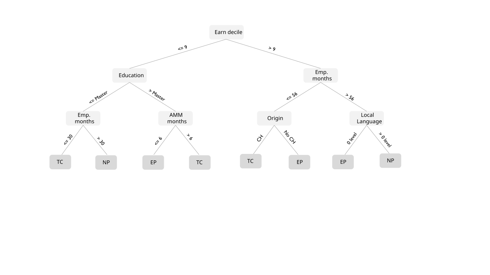
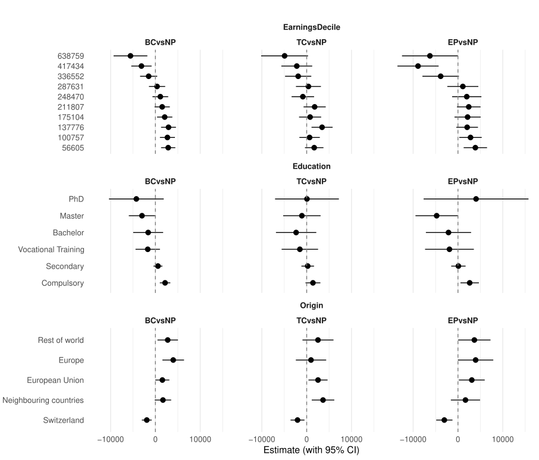
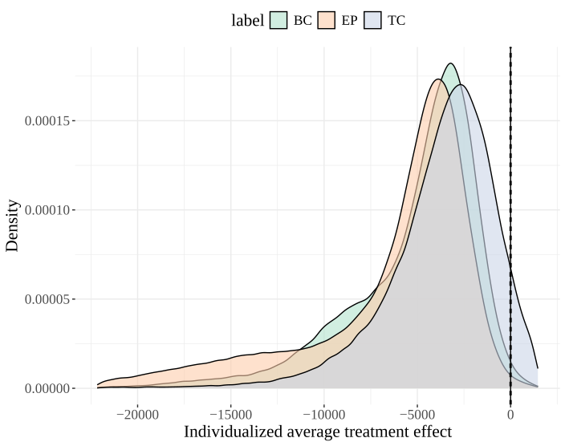

## Introduction {.center}
::: {.incremental}
Data-driven allocation of individuals to treatments has become increasingly important across diverse fields. 

  - Education: Allocating scholarships to students who benefit most
  - Marketing: Targeting discount to responsive consumers
  - Medicine: Personalizing treatment plans
::: 
. . .

::: {.incremental}
The **policy learning** approach relies on estimating heterogeneous treatment effects from observed characteristics and then allocating treatments to those predicted to benefit most. 
:::

## Introduction {.center}
::: {.incremental}

- Solve an optimization problem where the objective function allocates individuals to the best treatment, maximizing the expected average outcome.

- Each observation has the same contribution

- Existing literature on treatment allocation mostly relies on  <b>utilitarian welfare</b> functions <small>(e.g., Manski 2004; Kitagawa & Tetenov 2018; Zhou, Athey & Wager 2023)</small>

:::

. . .

::: {.incremental}

- This approach is convenient for statistical properties but

    - It can be an unstable measure of centrality
    - Overlook distributional impacts of a policy
    - May not align with a decision-maker’s preferences when the goal is to enhance the welfare of specific subgroups

::: 

<!---->

## This paper  {.center}
::: {.incremental}

**Goal**: Learn treatment assignment rules that reflect different welfare functions:

  - Utilitarian welfare function

  - Inequality-sensitive welfare function: Gini type of welfare to prioritize disadvantaged subgroups

  - Incorporate treatment costs to run a cost-sensitive analysis under utilitarian welfare

::: 

. . .

::: {.incremental}
**Method:**  Welfare is estimated using an influence-function approximation combined with doubly robust scores for potential outcomes.

Policy trees are then used to learn allocation rules under alternative welfare functions.  
:::

. . .

::: {.incremental}
**Empirical setting:** The assignment of Swiss unemployed to Active Labour Market Policies (ALMPs) 
::: 

<!---->

## Literature {.center}

::: {.incremental}
**Distribution-aware welfare in policy learning** 

- Kasy (2016), Kitagawa and Tetenov (2021), Terschuur (2023), Fan et al. (2025), 

- Kitagawa and Tetenov (2021): Develop the Empirical Social Welfare Maximization using Gini welfare types

- Kasy (2016): Proposes a method for welfare ranking of policies, using approximated Gini welfare under partial identification. The focus is on identification rather than decision problem 

:::

. . .

::: {.incremental}
**Policy learning applications to ALMPs** 

- Frölich (2008), Knaus (2022), Cockx et at. (2023), Burlat (2024), Mascolo et al. (2024)

     - Different welfare function
     - Most updated data available for Switzerland
:::

<!---->

#  

<h2 style="text-align: center;"> Data </h2>

<!---->

## Data {.center}
::: {.incremental}
**Active Labor Market Policies (ALMP):** Government interventions designed to enhance employment outcomes of unemployed

- **Basic course (BC)**: Orientation and job search skills (24\%)
- **Training course (TC)**: Language, IT, or vocational training for particular sectors (9\%)
- **Employment Programme (EP)**: Unpaid work outside the regular labor market (7\%)
- **No programme (NP)**: inviduals not assigned to a specific programe (60\%) 
:::

<!---->

## Data {.center}

::: {.incremental}
Dataset from diverse Swiss administrative records (2004-2018)
with individuals entering unemployment between 01/2014 and 06/2015 
:::

. . .

::: {.incremental}
**Outcomes:**

- Cumulative earnings in the first 12,24, and 36 months after the start of the unemployment spell
:::

. . .

::: {.incremental}
**Covariates:**

- Employment and earnings history over 10 years
- Socio-demographic characteristics
- Information on prior jobs and unemployment spells
- Regional labor market characteristics

:::

<!---->

#  

<h2 style="text-align: center;"> Parameters of Interest </h2>

## Parameters of Interest {.center}

::: {.incremental}
**Treatment Recommendation**  

- **Policy value (welfare)**: expected outcome when treatments are assigned according to a rule π  
- **Optimal policy rule**: mapping from covariates to treatments that maximise the policy value   
 
:::

<!---->

::: {.incremental}
**Treatment Evaluation**  

- **ATE**: average treatment effect for the population  
- **GATE**: average treatment effect for subgroups  
- **IATE**: average treatment effect conditional on covariates  
:::

<!----> 

## Identification {.center}

::: {.incremental}

- **Conditional independence assumption**
    - Control for most of the information caseworkers observe at the point of the assignment
    - Condition on key confounders identified in the literature

- **Common support assumption**: exclude observations outside support
- **Stable unit treatment value assumption**:  no-spillover effects
- **Exogeneity of covariates**: only pre-treatment covariates
:::

<!---->

#  

<h2 style="text-align: center;"> Policy Learning Framework </h2>

<!---->

## Policy Learning Framework {.center}

**Estimation**  

::: {.incremental} 

Doubly robust scores: $\Gamma(d,x) \;=\; \mu(d,x) + \frac{\mathbf{1}\{D=d\}}{e_d(x)}\bigl(Y - \mu(d,x)\bigr)$

:::

. . .

**Optimization**  

::: {.incremental}

Learn a treatment assignment rule (policy) that maximizes the expected average outcome for the population:

- A **policy $\pi$** is a mapping from covariates to treatments: $\pi: X \rightarrow D$  

- The **welfare** is the expected realised outcome when treatments are assigned according to the policy: 
$$Q(\pi)=\mathbb{E} [Y^{\pi(X)}] = \mathbb{E}\left[\sum_d 1\left(\pi\left(X\right)=d\right) \Gamma\left(d, X_i\right)\right]$$
- The objective is additive: can be rewritten as sum of unit-level expected potential outcomes

:::

## Policy $\pi$  {.center}

::: {.incremental}
Shallow Policy Tree of depth-3, outcome is cumulative earnings

{width=200%  style="display: block; margin: auto;"}
:::

<!---->

## Policy Learning with Gini Welfare {.center}

**Extended Gini Social Welfare Functional**
$$
W_k(F_{\pi}) = \int_0^\infty \bigl(1 - F_{\pi}(y)\bigr)^{k-1} \, dy
$$

::: {.incremental}
- $F_\pi(y)$: outcome distribution under policy $\pi$
- $(1 - F_{\pi}(y))$: survival function of outcomes under policy $\pi$  
- Exponent $k-1$: governs inequality aversion (weights lower outcomes more)  
:::

. . .

**Interpretation**

::: {.incremental}
- $k = 2$: utilitarian case $\;\; W_2(F_{\pi}) = \mathbb{E}[Y^{\pi(X)}]$  
- $k = 3$: corresponds to the Gini welfare criterion  
- $k > 3$: increasing emphasis on lower-ranked individuals  
:::

. . .

::: {.incremental}

The formulation makes the Extended Gini a flexible tool to study trade-offs between efficiency and equity in targeting policie
:::

<!---->

## Policy Learning with Gini Welfare, challenge {.center}
::: {.incremental}

- Extended Gini welfare is **non-separable**  
- Changing one person’s treatment affects the welfare contribution of all others 
- Computationally costly to recompute the whole outcome distribution for each candidate policy
- Kitagawa and Tetenov (2021) reduced the search space assigning all individuals with the same covariates to the same treatment, the computation remain intensive

:::

<!---->

## Policy Learning with Gini Welfare Approximation {.center}

::: {.incremental}
**Linearize welfare around baseline $F_0$**

$$
W_k(F_\pi) \;\approx\; 
W_k(F_0) + \int IF\!\bigl(y; W_{k}, F_0\bigr)\, dF_\pi(y)
$$
:::

. . .

::: {.incremental}
**Influence function (IF)**

$$
IF(y) = -k\, W_k(F_0) 
\;+\; k \int_0^y [1 - F_0(t)]^{k-1} dt
$$
:::

. . .

::: {.incremental}
**Pseudo-outcome $K(y)$**

$$
K(y) = k \int_0^y [1 - F_0(t)]^{k-1} dt
$$

$$
W_k(F_\pi) \;\approx\; (1-k)W_k(F_0) +  \,\mathbb{E}[K(Y^{\pi(X)})]
$$
:::

. . .

::: {.incremental}
**Intuition**

- $K(y)$ rescales outcomes by their rank in $F_0$ and Inequality aversion $k$ changes the weighting

:::

<!---->

## Implication {.center}
::: {.incremental}
- Welfare evaluation reduces to an **expectation of $K(Y)$**, just like in the utilitarian case  
- Makes Gini-based policy learning tractable using the empirical welfare maximisation machinery
- Limitation: only a **first-order approximation**, depends on the choice of $F_0$
:::

<!---->

## Estimation and implementation {.center}

### 1. Pseudo-outcome construction
::: {.incremental}

- Using the empirical distribution $F_0$ under the reference policy  

- Define the welfare-reweighted outcome $K(Y_i) = k \int_0^{Y_i} [1 - F_0(t)]^{k-1} dt$
:::

### 2. Nuisance estimation
::: {.incremental}

- Construct (cross-fitted) **doubly robust scores**: 
$$\widehat\Gamma_i(d) =\widehat m_{K,d}(X_i) + \frac{\mathbf{1}\{D_i=d\}}{\widehat e_d(X_i)} \bigl(K(Y_i) - \widehat m_{K,d}(X_i)\bigr)$$

:::

<!---->

### 3. Policy optimization
::: {.incremental}

- Empirical welfare:  $\widehat W(\pi) = \frac{1}{n}\sum_{i=1}^n \widehat\Gamma_i(\pi(X_i))$

- Optimal policy:  $\widehat\pi = \arg\max_{\pi \in \Pi} \widehat W(\pi)$ 

:::

<!---->

## Estimator, Policy Class and covariates {.center}
::: {.incremental}

- **Scores Estimator**: Tuned Causal Forests with cross-fitting (Chernozhukov et al., 2018)

- **Policy Class**: Shallow Policy Trees (Zhou, Athey and Wager, 2023)

- **Covariates**: Pre-defined heterogeneity covariates and classification analysis 
    -  Classification analysis (Chernozhukov et al., 2018b): selects covariates with the largest standardised mean differences between individuals in the lowest and highest quintiles of the ordered predicted IATEs.

    - Education level (Crépon et al. 2013, and classification analysis), proficiency in the local language (Knaus et al., 2022; Cockx et al., 2023, and classification analysis), labor market history (Cockx et al., 2023 and classification analysis)
    
:::

<!---->

#  

<h2 style="text-align: center;"> Preliminary Results </h2>

<!---->

## Results {.center}
**Average Treatment Effects for Earnings** 

::: {.incremental}

| Programme   | 12 months     | 13–24 months | 25–36 months |
|-------------|---------------|--------------|--------------|
| **BC vs NP** | -14,603*** (182) | -7,441*** (285) | -5,109*** (327) |
| **TC vs NP** | -11,643*** (274) | -4,822*** (445) | -3,897*** (467) |
| **EP vs NP** | -14,266*** (369) | -8,915*** (664) | -6,043*** (545) |

<small>*Note:* ATEs of participation in different programmes compared to non-participation (NP). BC: Basic Courses; TC: Training Courses; EP: Employment Programme.  Standard errors in parentheses. \*, \*\*, \*\*\* denote significance at the 10%, 5%, and 1% levels.</small>

:::

<!---->

## Results {.center}
**Group Average Treatment Effects minus ATE for Cumulative Earnings**

::: {.incremental}
{width=65%  style="display: block; margin: auto;"}
:::

<!---->

## Results {.center}
**Individualised Average Treatment Effects for Cumulative Earnings** 

::: {.incremental}
{width=65%  style="display: block; margin: auto;"}
:::

<!---->

## Results  {.center}
**Treatment Recommendations** 

::: {.incremental}
Programme shares and welfare under different decision tree depths 

| Policy                        | NP   | BC   | TC   | EP   | Welfare |
|-------------------------------|------|------|------|------|---------|
| *Observed*                 | 0.60 | 0.24 | 0.09 | 0.07 | 47,049   |
| *Utilitarian objective*        |      |      |      |      |         |
| Decision tree depth-2       | 0.80 | 0.00 | 0.08 | 0.12 | 48,859  |
| Decision tree depth-3        | 0.83 | 0.00 | 0.14 | 0.03 | 49,819  |
| *Inequality-sensitive (k=3)*  |      |      |      |      |         |
| Decision tree depth-2        | 0.78 | 0.00 | 0.09 | 0.13 | 52,715  |
| Decision tree depth-3         | 0.73 | 0.00 | 0.16 | 0.11 | 53,206  |
| *Inequality-sensitive (k=4)*  |      |      |      |      |         |
| Decision tree depth-2         | 0.78 | 0.00 | 0.09 | 0.13 | 52,773  |
| Decision tree depth-3         | 0.61 | 0.00 | 0.14 | 0.25 | 50,977  |

<small>*Notes* NP = No Programme, BC = Basic Course, TC = Training Course, EP = Employment Programme,
 Welfare measured as average sum of earnings in the third year after the unemployment spell start</small>

:::

<!---->

#  

<h2 style="text-align: center;"> Conclusions </h2>

## Conclusion and Next Steps {.center}
::: {.incremental}

**Conclusions**

   - Developed a framework to estimate policy rules under both utilitarian and inequality-sensitive welfare

   - Used an influence function approach to capture inequality aversion, combined with shallow policy trees for treatment recommendation 

   - Even with limited heterogeneity, results suggest reallocating ~24% of individuals from BC to NP to improve utilitarian and inequality-sensitive welfare 

:::

. . .

::: {.incremental}

**Next Steps**

- Refine conditions under which the influence-function-based welfare is a reliable approximation

- Develop inference methods for welfare estimates

- Regret bounds on the policy rule

- Extend the framework to incorporate cost-sensitive allocations 

:::
